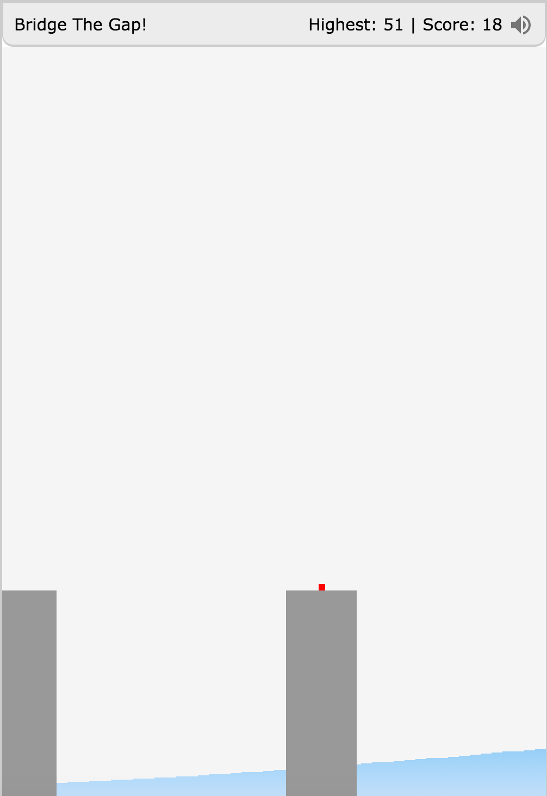
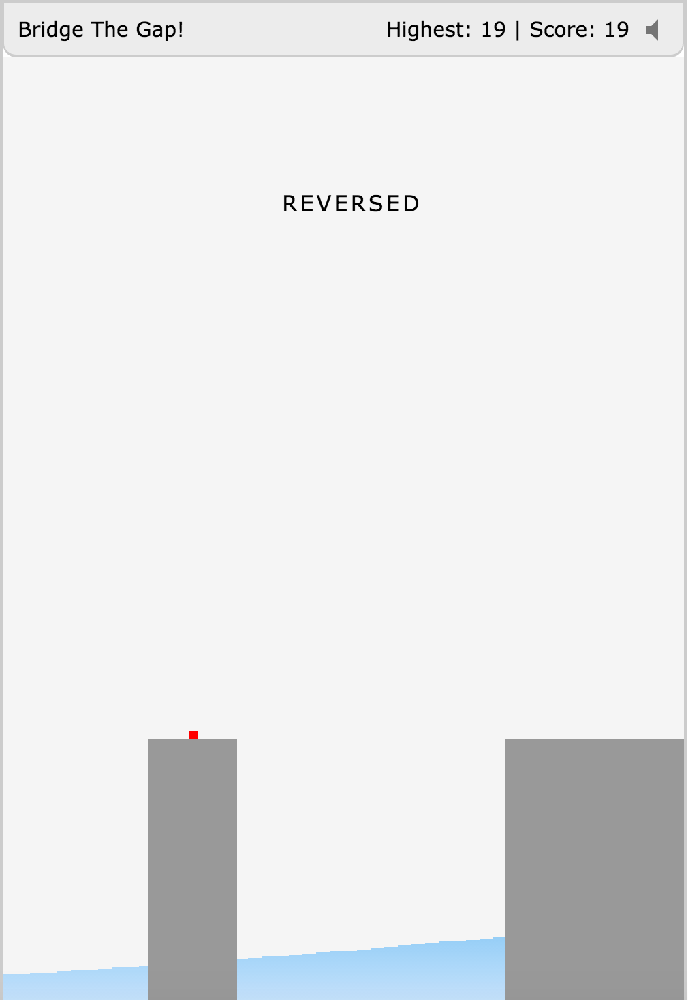

Bridge The Gap
==============

Entry game for [js13kGames](http://2015.js13kgames.com/) competition.

A simple HTML5 game where a player has to create bridges in order to cross buildings.

Rules
-----

1. Press down to start creating a bridge.
2. Release to lay down the bridge across buildings.
3. If bridge completely lies over buildings, player is awarded with a +1 score and is moved ahead.
4. If a player places one of the bridge's end exactly over the mid-point(central point) of the building, a bonus +1 point is awarded.
5. If bridge fails to completely lie across the two buildings, then game is OVER!

REVERSED Mode
-------------

1. REVERSED mode is set in an aperiodic manner(at random intervals) where buildings swap their locations and a player has to lay bridge in an opposite direction(RIght to Left).

Technology
----------

This game is developed using HTML5, CSS3 and JavaScript.

Animations and Transitions using CSS3

Sound Effects using [jsfxr](https://github.com/mneubrand/jsfxr)
